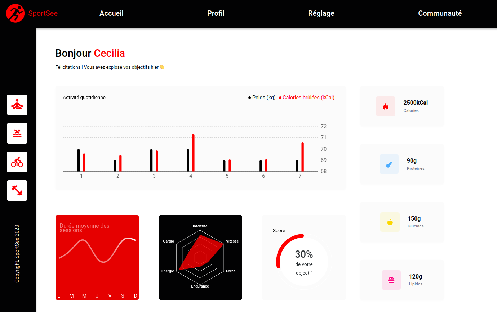

# SPORTSEA



## Table of contents
- [Context](#context)
- [Installation](#installation)
  - [Prerequisites](#prerequisites)
  - [Setup](#setup)
    - [Back end](#back-end)
    - [Front end](#front-end)
- [Display user data](#display-user-data)
- [What this project allowed me to practice](#what-this-project-allowed-me-to-practice)
  - [Skills](#skills)
  - [Technologies / methods](#technologies--methods)
- [Resources](#resources)
- [Expected deliverables](#expected-deliverables)


## Context
SportSea is a startup dedicated to sports coaching. She wants to launch a new version of the user's profile page. 

This page will in particular allow the user to follow :
* the number of sessions carried out,
* the number of calories burned.


## Installation

### Prerequisites

* NodeJS v16.13.1

### Setup

#### Back end

Clone the repository, then :
```
cd back-end
npm run install
npm run start
```

#### Front end

Clone the repository, then :
```
cd front-end
npm run install
npm run start
```

## Display user data

To display the profiles of the 2 users, add the following URIs :
- /user/12,
- /user/18.
 

## What this project allowed me to practice

### Skills

- cut and integrate a template,
- structure a web page in React components,
- format a web page with HTML and CSS3,
- generate content dynamically from an API,
- create graphics with the Recharts library


### Technologies / methods

- HTML5 / CSS3,
- SaSS v6.0.1
- React v17.0.2, 
- React Router Dom v5.3.0,
- Recharts v2.1.8.

## Resources

* desktop template,
* backend.


## Expected deliverables

- cutting into modular and reusable components,
- one component per file,
- logical structure of the different files,
- use of props between components,
- use of state in components when necessary,
- the code should not produce an error or warning in the console.
