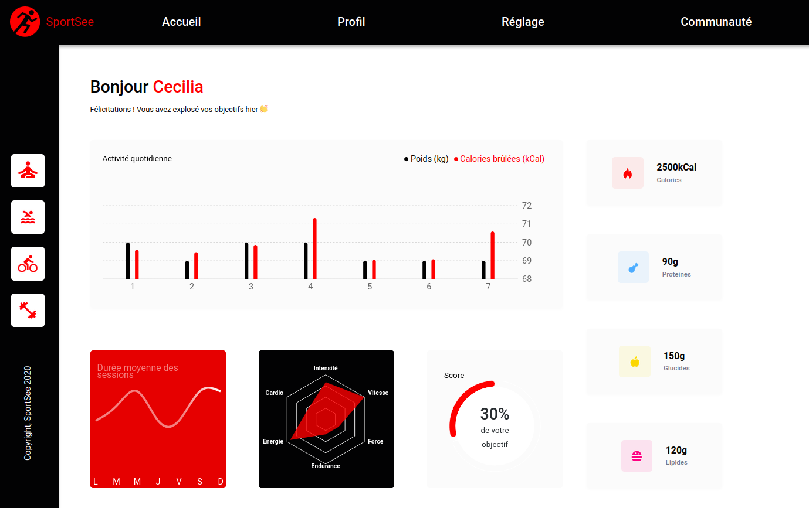

# SPORTSEA

## Présentation du contexte
SportSea est une startup dédiée au coaching sportif. 
Elle souhaite lancer une nouvelle version de la page profil de l’utilisateur. 

Cette page va notamment permettre à l’utilisateur de suivre :
* le nombre de sessions réalisées,
* le nombre de calories brûlées.

## Lancer la démonstration
* cloner le repository du backEnd : https://github.com/OpenClassrooms-Student-Center/P9-front-end-dashboard
* cloner le repository du front end ici présent
* lancer la back end avec : npm run start
* lancer le front end avec : npm run start

Pour affiche les profils des 2 utilisateurs, ajouter les URI suivantes :
- /user/12,
- /user/18.
 

## Ce que ce projet m'a permis de pratiquer

### Compétences

- découper et intégrer une maquette,
- structurer une page web en composants React,
- mettre en forme une page web avec HTLM et CSS3,
- générer du contenu dynamiquement depuis une api,
- réaliser des graphiques avec la librairie Recharts

### Technologies / méthodes

- HTML5 / CSS3,
- Sass,
- React, React DOM, React Router,
- Recharts / D3

## Ressources à ma disposition

* maquette desktop,
* backend.

## Consignes

- pouvoir afficher les informations des 2 profils utilisateurs
  - /user/12,
  - /user/18.

## Livrables attendus

- découpage en composants modulaires et réutilisables,
- un composant par fichier,
- structure logique des différents fichiers,
- utilisation des props entre les composants,
- utilisation du state dans les composants quand c'est nécessaire,
- le code ne devait pas produire d'erreur ou de warning dans la console.
